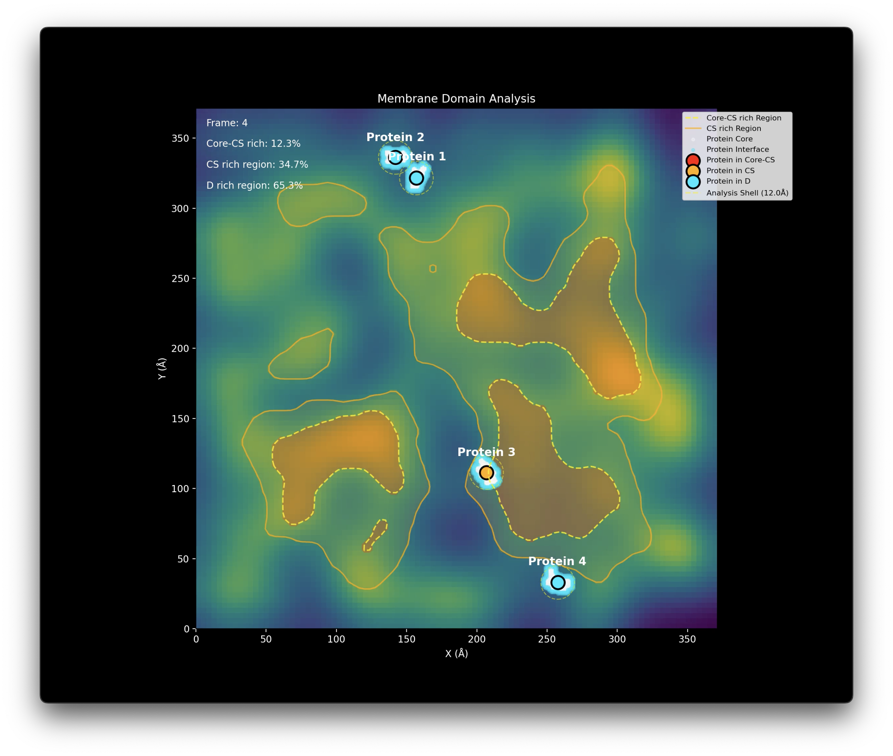

# MemDomA - Membrane Domain Analysis for MARTINI Coarse-Grained Simulations

[](https://doi.org/10.5281/zenodo.XXXXXXX)
[](https://github.com/takeshi-sato-dev/MemDomA/actions/workflows/CI.yml)
[](https://opensource.org/licenses/MIT)
[](https://www.python.org)

Automated analysis of membrane domains and protein partitioning from MARTINI coarse-grained molecular dynamics simulations.


*Example output showing three-tier domain classification: Core-CS rich (brown), CS rich (orange boundaries), and D rich regions (blue-green), with four transmembrane proteins tracked in real-time.*

## Features

- **Three-Tier Domain Classification**: 
  - Core-CS rich regions (highest cholesterol/sphingomyelin organization)
  - CS rich regions (moderate organization)
  - D rich regions (disordered/fluid regions)
- **Flexible Protein Analysis**: Analyze any number of membrane proteins
- **Customizable Lipid Types**: Support for any MARTINI lipid types
- **Order Parameter Calculation**: MARTINI-specific S_CD calculations
- **GM3 Colocalization Analysis**: Quantifies ganglioside clustering
- **Time-Resolved Analysis**: Domain evolution over simulation time
- **Publication-Quality Visualization**: Automated figure and animation generation

## How It Works

### Domain Detection Algorithm

Unlike simple density-based methods, this package uses a **multi-parameter approach**:

1. **Order Parameter Mapping**: Calculates S_CD for each lipid and creates spatial maps
2. **Lipid-Specific Densities**: Separate density calculations for CHOL, SM, and GM3
3. **Integrated Scoring**: Combines all parameters with optimized weights:
   - Total lipid density (20%)
   - Order parameters (25%)
   - Cholesterol density (30%)
   - Sphingomyelin density (25%)
4. **Adaptive Thresholding**: Identifies three domain types:
   - **Core-CS rich**: Highly ordered centers (> μ + 1.0σ)
   - **CS rich**: Raft-like regions (> μ + 0.6σ)
   - **D rich**: Disordered/fluid regions (≤ μ + 0.6σ)

## System Requirements

### Core Requirements
- **MARTINI Coarse-Grained force field** (v2.x/3.x)
- **MARTINI bead naming conventions** for order parameter calculations (??A, ??B patterns)

### Fully Customizable Components
✅ **Number of proteins**: Analyze 1, 2, 4, or any number of proteins  
✅ **Protein names/segments**: Use your own naming scheme  
✅ **Lipid types**: Any MARTINI-compatible lipids  
✅ **Selection criteria**: Define your own protein/lipid selections  

## Installation

### Prerequisites
- Python ≥ 3.10
- ffmpeg (for animations)

### From source
```bash
git clone https://github.com/takeshi-sato-dev/MemDomA.git
cd MemDomA/memdoma
pip install -r requirements.txt
pip install -e .
```

### Dependencies
```
MDAnalysis ≥ 2.0.0
numpy ≥ 1.20.0
scipy ≥ 1.7.0
pandas ≥ 1.3.0
matplotlib ≥ 3.4.0
tqdm ≥ 4.62.0
psutil ≥ 5.8.0
```

## Quick Start

### Using default configuration
```python
from memdoma_package import MemDomA

analysis = MemDomA(
    psf_file='your_system.psf',
    xtc_file='your_trajectory.xtc',
    start=20000,
    stop=80000,
    step=100
)

analysis.setup()
analysis.run_analysis()
analysis.generate_visualizations(output_dir='results')
```

## Customization

### Custom Proteins (Any Number or Naming)
```python
from memdoma_package import MemDomA

analysis = MemDomA(
    psf_file='your_system.psf',
    xtc_file='your_trajectory.xtc'
)

# Define YOUR proteins (any number, any naming)
my_proteins = {
    "TM_Protein_1": "segid TM1 and name BB",
    "TM_Protein_2": "segid TM2 and name BB", 
    "GPCR_1": "segid GPCR and resid 1:350",
    "Ion_Channel": "segid ION and name BB",
    # Add as many as you need!
}

# Define YOUR lipids
my_lipids = ["POPC", "POPE", "POPS", "CHOL", "GM1"]

analysis.setup(
    protein_definitions=my_proteins,
    lipid_types=my_lipids
)

analysis.run_analysis()
```

## Quick Test with Sample Data

### 1. Test Installation
```bash
# Check if package imports correctly
python -c "from memdoma_package import MemDomA; print('✓ MemDomA imported successfully!')"
```

### 2. Run Complete Test
```bash
# Run complete test with sample data
python examples/test_with_sample_data.py
```

Or run manually:
```python
from memdoma_package import MemDomA

# Initialize with test data
analysis = MemDomA(
    psf_file='test_data/test_system.psf',
    xtc_file='test_data/test_trajectory.xtc',
    start=0,
    stop=8,  # test data has 8 frames
    step=1,
    use_multiprocessing=False
)

# Setup with test data lipids
analysis.setup(
    lipid_types=["DPSM", "DOPC", "DOPS", "DPG3"],
    protein_definitions={
        "Protein A": "segid PROA and backbone",
        "Protein B": "segid PROB and backbone"
    }
)

# Run analysis
analysis.run_analysis()

# Generate all outputs
analysis.generate_visualizations(
    output_dir='test_output',
    animation=True,
    plots=True
)
```

### 3. Check Output Files
After running the test, you should see:
- `test_output